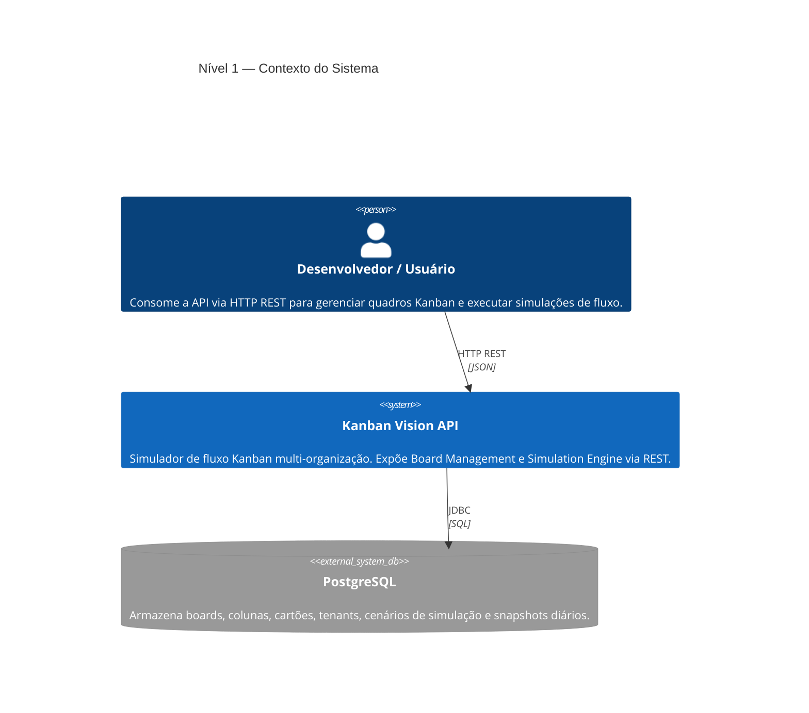
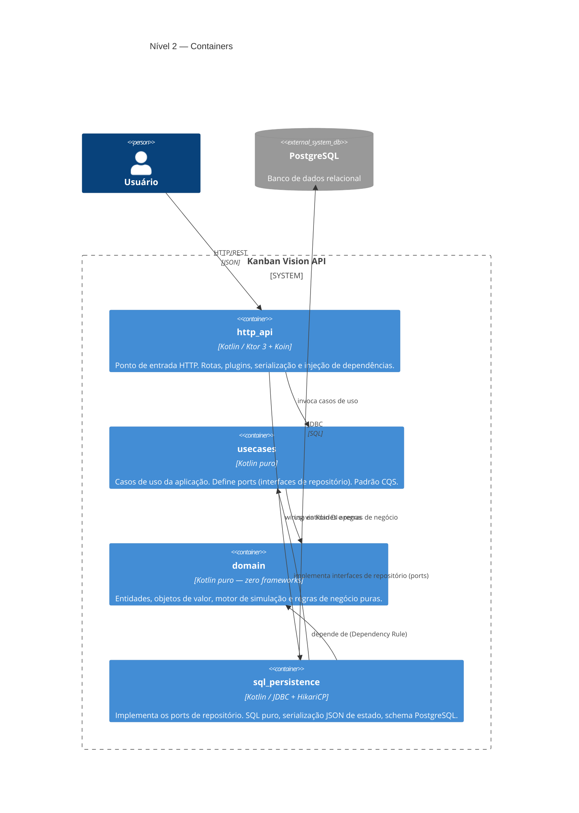
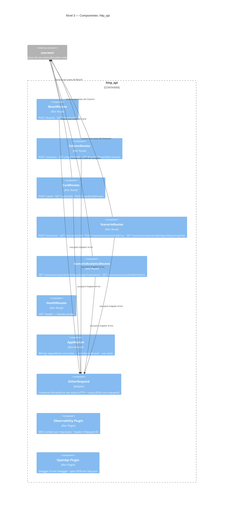
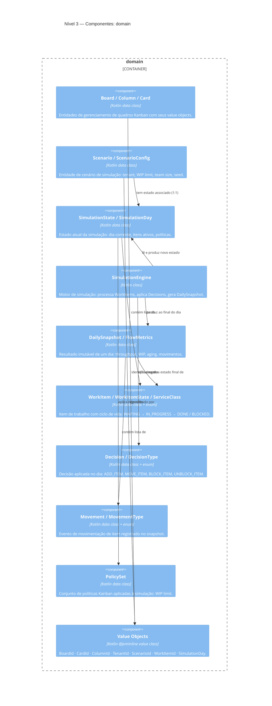
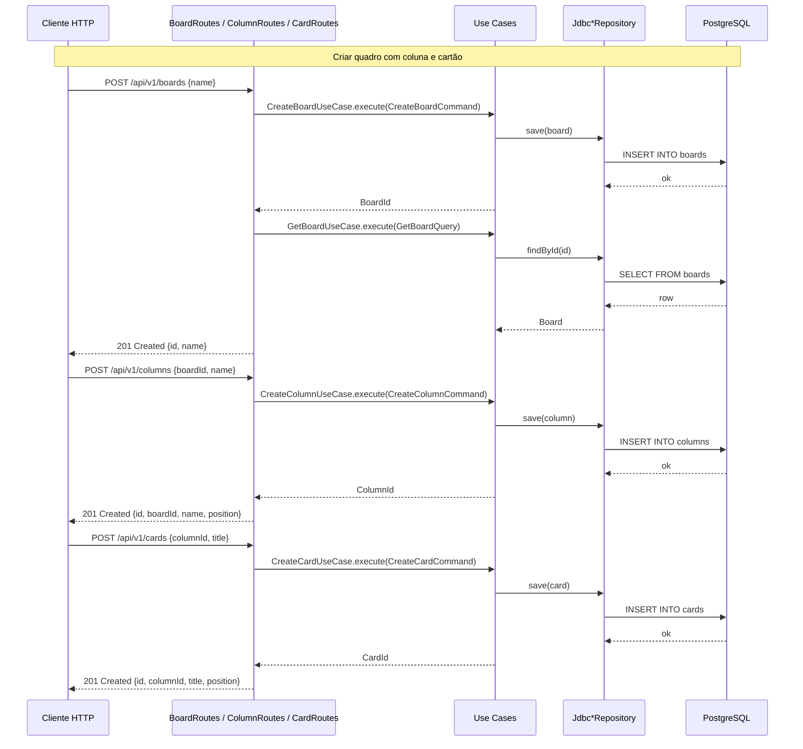
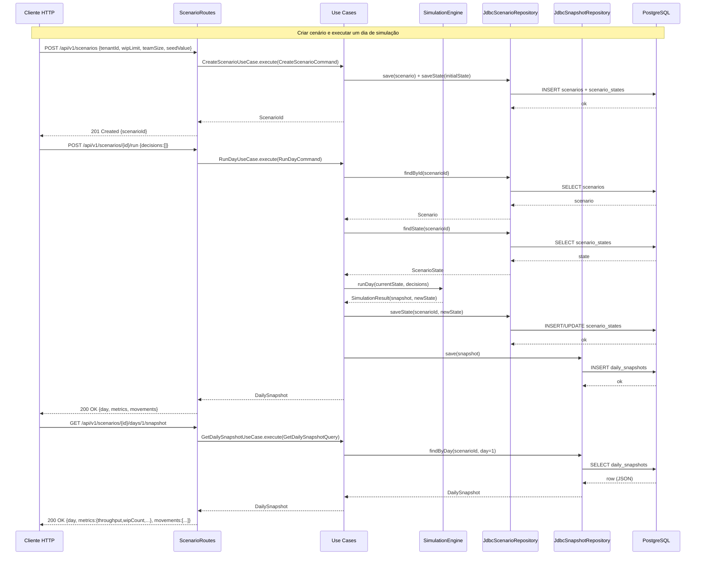

[](https://github.com/agnaldo4j/kanban-vision-api-kt/actions/workflows/ci.yml)

# Kanban Vision API

> Simulador de fluxo Kanban multi-organização via API REST — construído em Kotlin com foco em arquitetura limpa, qualidade de código e boas práticas de engenharia de software.

---

## Quick Start

```bash
# 1. Clone o repositório
git clone https://github.com/agnaldo4j/kanban-vision-api-kt.git
cd kanban-vision-api-kt

# 2. Configure Java 21 (obrigatório — o projeto não é compatível com Java 25+)
# Sobrescreva o path em gradle.properties com o Java 21 da sua máquina:
export JAVA_HOME=$(/usr/libexec/java_home -v 21)
echo "org.gradle.java.home=$JAVA_HOME" >> gradle.properties

# 3. Compile e rode todos os testes + quality gates
./gradlew testAll

# 4. Suba o banco de dados
docker run -d --name kanban-db \
  -e POSTGRES_DB=kanbanvision \
  -e POSTGRES_USER=kanban \
  -e POSTGRES_PASSWORD=kanban \
  -p 5432:5432 \
  postgres:16

# 5. Execute a aplicação
./gradlew :http_api:run
```

Acesse a documentação interativa: **http://localhost:8080/swagger**

---

## Sobre o projeto

O **Kanban Vision** é um simulador de fluxo Kanban para múltiplas organizações. Ele expõe dois domínios via API REST:

1. **Board Management** — criar quadros (`Board`), organizar colunas (`Column`) e mover cartões (`Card`) entre estágios.
2. **Simulation Engine** — criar cenários de simulação (`Scenario`) por tenant, executar dias de simulação com decisões configuráveis (`RunDay`), persistir snapshots diários (`DailySnapshot`) e recuperar métricas de fluxo (`FlowMetrics`).

O projeto foi concebido como uma **referência prática** de arquitetura hexagonal em Kotlin, demonstrando como separar domínio, casos de uso, persistência e entrega HTTP de forma clara e testável.

---

## Arquitetura

O projeto segue os princípios de **Clean Architecture** (Arquitetura Hexagonal) combinados com **Screaming Architecture** — os módulos e pacotes expressam a intenção do negócio, não os frameworks utilizados.

```
┌─────────────────────────────────────┐
│             http_api                │  ← Entrega HTTP (Ktor + Koin)
│  routes / plugins / di              │
└──────────────┬──────────────────────┘
               │ depende de
┌──────────────▼──────────────────────┐
│             usecases                │  ← Casos de uso (CQS)
│  board / card / column / scenario   │
│  repositories (ports)               │
└──────────────┬──────────────────────┘
               │ depende de
┌──────────────▼──────────────────────┐
│              domain                 │  ← Núcleo do negócio (puro Kotlin)
│  model / valueobjects / simulation  │
└─────────────────────────────────────┘

┌─────────────────────────────────────┐
│          sql_persistence            │  ← Adaptador de banco (JDBC + HikariCP)
│  repositories / serializers         │
└─────────────────────────────────────┘
```

### Fluxo de dependências

```
http_api → usecases → domain
sql_persistence → domain
sql_persistence → usecases   (implementa as interfaces de repositório)
http_api → sql_persistence   (somente na camada de DI via Koin)
```

O módulo `domain` não conhece nenhum framework. O módulo `usecases` não conhece banco de dados nem HTTP.

---

## Arquitetura — Diagramas C4

### Nível 1 — Contexto do Sistema



### Nível 2 — Containers



### Nível 3 — Componentes: http_api



### Nível 3 — Componentes: domain



### Sequência — Board Management



### Sequência — Simulation Engine



### Classes — Domínio

```mermaid
classDiagram
  class Board {
    +BoardId id
    +String name
  }
  class Column {
    +ColumnId id
    +BoardId boardId
    +String name
    +Int position
  }
  class Card {
    +CardId id
    +ColumnId columnId
    +String title
    +String description
    +Int position
  }
  class Scenario {
    +ScenarioId id
    +TenantId tenantId
    +ScenarioConfig config
    +create(tenantId, config) Scenario
  }
  class ScenarioConfig {
    +Int wipLimit
    +Int teamSize
    +Long seedValue
  }
  class SimulationState {
    +SimulationDay currentDay
    +PolicySet policySet
    +List~WorkItem~ items
  }
  class SimulationEngine {
    +runDay(scenarioId, state, decisions, seed) SimulationResult
  }
  class SimulationResult {
    +SimulationState newState
    +DailySnapshot snapshot
  }
  class DailySnapshot {
    +ScenarioId scenarioId
    +SimulationDay day
    +FlowMetrics metrics
    +List~Movement~ movements
  }
  class FlowMetrics {
    +Int throughput
    +Int wipCount
    +Int blockedCount
    +Double avgAgingDays
  }
  class WorkItem {
    +WorkItemId id
    +String title
    +WorkItemState state
    +ServiceClass serviceClass
    +Int agingDays
  }
  class WorkItemState {
    <<enumeration>>
    TODO
    IN_PROGRESS
    BLOCKED
    DONE
  }
  class Decision {
    +DecisionId id
    +DecisionType type
    +Map~String,String~ payload
  }
  class DecisionType {
    <<enumeration>>
    ADD_ITEM
    MOVE_ITEM
    BLOCK_ITEM
    UNBLOCK_ITEM
  }
  class Movement {
    +WorkItemId workItemId
    +MovementType type
    +SimulationDay day
    +String reason
  }
  class PolicySet {
    +Int wipLimit
  }

  Board "1" *-- "0..*" Column : contém
  Column "1" *-- "0..*" Card : contém
  Scenario "1" --> "1" ScenarioConfig : configurado por
  SimulationState "1" *-- "0..*" WorkItem : gerencia
  SimulationState "1" --> "1" PolicySet : aplica
  SimulationEngine ..> SimulationState : processa
  SimulationEngine ..> Decision : aplica
  SimulationEngine ..> SimulationResult : produz
  SimulationResult "1" --> "1" SimulationState : novo estado
  SimulationResult "1" --> "1" DailySnapshot : snapshot
  DailySnapshot "1" --> "1" FlowMetrics : contém
  DailySnapshot "1" *-- "0..*" Movement : registra
  WorkItem --> WorkItemState : tem estado
  Decision --> DecisionType : é do tipo
  ```

---

## Padrão CQS (Command Query Separation)

Cada caso de uso recebe um objeto tipado que implementa `Command` (modifica estado) ou `Query` (lê estado), com validação explícita antes da execução:

### Board Management

```
CreateBoardCommand       → CreateBoardUseCase           → BoardId
GetBoardQuery            → GetBoardUseCase              → Board

CreateColumnCommand      → CreateColumnUseCase          → ColumnId
GetColumnQuery           → GetColumnUseCase             → Column
ListColumnsByBoardQuery  → ListColumnsByBoardUseCase    → List<Column>

CreateCardCommand        → CreateCardUseCase            → CardId
MoveCardCommand          → MoveCardUseCase              → Unit
GetCardQuery             → GetCardUseCase               → Card
```

### Simulation Engine

```
CreateScenarioCommand    → CreateScenarioUseCase        → ScenarioId
RunDayCommand            → RunDayUseCase                → DailySnapshot
GetScenarioQuery         → GetScenarioUseCase           → ScenarioWithState
GetDailySnapshotQuery    → GetDailySnapshotUseCase      → DailySnapshot
```

---

## Tratamento de Erros (Either)

Os erros de domínio são modelados como valores com Arrow-kt `Either<DomainError, T>`, eliminando exceções como mecanismo de controle de fluxo.

### Hierarquia DomainError

```
sealed class DomainError
├── ValidationError(message)      → HTTP 400
├── InvalidDecision(reason)       → HTTP 400
├── BoardNotFound(id)             → HTTP 404
├── ColumnNotFound(id)            → HTTP 404
├── CardNotFound(id)              → HTTP 404
├── TenantNotFound(id)            → HTTP 404
├── ScenarioNotFound(id)          → HTTP 404
├── DayAlreadyExecuted(day)       → HTTP 409
└── PersistenceError(message)     → HTTP 500
```

### Padrão nos Use Cases

```kotlin
suspend fun execute(command: RunDayCommand): Either<DomainError, DailySnapshot>
```

### Padrão nas Rotas

```kotlin
useCase.execute(command).fold(
    ifLeft  = { error  -> call.respondWithDomainError(error) },
    ifRight = { result -> call.respond(result) },
)
```

---

## Módulos

| Módulo | Responsabilidade |
|---|---|
| `domain` | Entidades, objetos de valor, motor de simulação, regras de negócio puras |
| `usecases` | Casos de uso, interfaces de repositório (ports), CQS |
| `sql_persistence` | Implementações JDBC, serialização JSON de estado, schema SQL |
| `http_api` | Rotas HTTP, serialização, injeção de dependências, ponto de entrada |

---

## Stack

| Preocupação | Tecnologia |
|---|---|
| Linguagem | Kotlin 2.1 |
| HTTP | Ktor 3 (Netty) |
| Serialização | kotlinx.serialization |
| Injeção de dependência | Koin 4 |
| Pool de conexões | HikariCP |
| Banco de produção | PostgreSQL |
| Banco de testes | Embedded PostgreSQL (zonky) |
| Logging | SLF4J + MDC |
| Testes | JUnit 5 + MockK |
| Documentação API | ktor-openapi + Swagger UI |
| Análise estática | Detekt |
| Estilo de código | KtLint |
| Cobertura | JaCoCo (mínimo 90%) |
| Build | Gradle 8 (Kotlin DSL) |
| Java | Java 21 |

---

## Estrutura de pacotes

```
domain/
├── model/
│   ├── Board.kt, Card.kt, Column.kt
│   ├── valueobjects/   BoardId, CardId, ColumnId, TenantId, ScenarioId, WorkItemId
│   ├── tenant/         Tenant.kt
│   ├── scenario/       Scenario, ScenarioConfig, SimulationState, SimulationDay,
│   │                   SimulationResult, DailySnapshot
│   ├── workitem/       WorkItem, WorkItemState, ServiceClass
│   ├── decision/       Decision, DecisionId, DecisionType
│   ├── movement/       Movement, MovementType
│   ├── metrics/        FlowMetrics
│   └── policy/         PolicySet
└── simulation/
    └── SimulationEngine.kt

usecases/
├── cqs/                Command.kt, Query.kt
├── board/              CreateBoardUseCase, GetBoardUseCase + commands/queries
├── card/               CreateCardUseCase, GetCardUseCase, MoveCardUseCase + commands/queries
├── column/             CreateColumnUseCase, GetColumnUseCase, ListColumnsByBoardUseCase + commands/queries
├── scenario/           CreateScenarioUseCase, RunDayUseCase, GetScenarioUseCase,
│                       GetDailySnapshotUseCase + commands/queries
└── repositories/       BoardRepository, CardRepository, ColumnRepository,
                        TenantRepository, ScenarioRepository, SnapshotRepository

sql_persistence/
├── DatabaseFactory.kt        (schema: boards, columns, cards, tenants, scenarios,
│                              scenario_states, daily_snapshots)
├── repositories/             JdbcBoardRepository, JdbcCardRepository, JdbcColumnRepository,
│                             JdbcTenantRepository, JdbcScenarioRepository, JdbcSnapshotRepository
└── serializers/              SimulationStateSerializer, DailySnapshotSerializer

http_api/
├── Main.kt
├── adapters/           EitherRespond.kt
├── di/                 AppModule.kt
├── plugins/            Observability, Routing, Serialization, StatusPages, OpenApi
└── routes/             BoardRoutes, CardRoutes, ColumnRoutes, HealthRoutes, ScenarioRoutes
```

---

## API REST

Todas as rotas seguem o prefixo `/api/v1`. Documentação interativa disponível em `/swagger`.

### Quadros (Boards)

| Método | Rota | Descrição |
|---|---|---|
| `POST` | `/api/v1/boards` | Cria um novo quadro |
| `GET` | `/api/v1/boards/{id}` | Busca um quadro pelo ID |

### Colunas (Columns)

| Método | Rota | Descrição |
|---|---|---|
| `POST` | `/api/v1/columns` | Cria uma coluna em um quadro |
| `GET` | `/api/v1/columns/{id}` | Busca uma coluna pelo ID |
| `GET` | `/api/v1/boards/{boardId}/columns` | Lista todas as colunas de um quadro |

### Cartões (Cards)

| Método | Rota | Descrição |
|---|---|---|
| `POST` | `/api/v1/cards` | Cria um cartão em uma coluna |
| `GET` | `/api/v1/cards/{id}` | Busca um cartão pelo ID |
| `PATCH` | `/api/v1/cards/{id}/move` | Move o cartão para outra coluna/posição |

### Simulação (Scenarios)

| Método | Rota | Descrição |
|---|---|---|
| `POST` | `/api/v1/scenarios` | Cria um cenário de simulação para um tenant |
| `GET` | `/api/v1/scenarios/{scenarioId}` | Retorna o cenário e o estado atual |
| `POST` | `/api/v1/scenarios/{scenarioId}/run` | Executa um dia de simulação |
| `GET` | `/api/v1/scenarios/{scenarioId}/days/{day}/snapshot` | Retorna o snapshot de um dia |

### Exemplos curl — Simulação

```bash
# Criar um cenário (requer tenant previamente cadastrado via SQL)
curl -s -X POST http://localhost:8080/api/v1/scenarios \
  -H "Content-Type: application/json" \
  -d '{"tenantId":"<uuid>","wipLimit":3,"teamSize":2,"seedValue":42}' | jq

# Consultar estado do cenário
curl -s http://localhost:8080/api/v1/scenarios/<scenarioId> | jq

# Executar o próximo dia (sem decisões)
curl -s -X POST http://localhost:8080/api/v1/scenarios/<scenarioId>/run \
  -H "Content-Type: application/json" \
  -d '{"decisions":[]}' | jq

# Executar o próximo dia com decisões
curl -s -X POST http://localhost:8080/api/v1/scenarios/<scenarioId>/run \
  -H "Content-Type: application/json" \
  -d '{"decisions":[{"type":"ADD_ITEM","payload":{"title":"Nova tarefa","serviceClass":"STANDARD"}}]}' | jq

# Consultar snapshot do dia 1
curl -s http://localhost:8080/api/v1/scenarios/<scenarioId>/days/1/snapshot | jq
```

**Tipos de decisão disponíveis:** `MOVE_ITEM`, `BLOCK_ITEM`, `UNBLOCK_ITEM`, `ADD_ITEM`

---

## Rastreabilidade (Observabilidade)

Cada requisição recebe um identificador único de correlação propagado em toda a execução:

- **Header de entrada**: `X-Request-ID` — reutilizado se enviado pelo cliente.
- **Header de resposta**: `X-Request-ID` — sempre presente.
- **MDC**: `requestId`, `scenarioId` e `day` são adicionados ao contexto de log.
- **Erros**: todas as respostas `4xx`/`5xx` incluem `requestId` no corpo JSON.

```
14:22:01.123 [ktor-nio-thread-1] INFO [rid=3f2a1b4c] - POST /api/v1/scenarios/run → 200 OK
```

---

## Documentação OpenAPI

- **Swagger UI**: `http://localhost:8080/swagger`
- **OpenAPI JSON**: `http://localhost:8080/api.json`

---

## Como executar

### Pré-requisitos

- Java 21
- PostgreSQL (ou Docker)

### Configuração do banco

```bash
docker run -d \
  --name kanban-db \
  -e POSTGRES_DB=kanbanvision \
  -e POSTGRES_USER=kanban \
  -e POSTGRES_PASSWORD=kanban \
  -p 5432:5432 \
  postgres:16
```

### Subir a aplicação

```bash
./gradlew :http_api:run
```

### Build do JAR

```bash
./gradlew :http_api:buildFatJar
java -jar http_api/build/libs/kanban-vision-api.jar
```

---

## Qualidade de código

```bash
# Todos os testes + análise + cobertura
./gradlew testAll

# Por módulo
./gradlew :domain:check
./gradlew :usecases:check
./gradlew :sql_persistence:check
./gradlew :http_api:check

# Formatar código automaticamente (KtLint)
./gradlew ktlintFormat
```

O pipeline de qualidade exige:
- **Detekt** — análise estática sem violações (`warningsAsErrors = true`)
- **KtLint** — estilo de código consistente
- **JaCoCo** — cobertura mínima de 90% de instruções por módulo

---

## Testes

```bash
# Rodar todos
./gradlew testAll

# Por módulo
./gradlew :domain:test
./gradlew :usecases:test
./gradlew :sql_persistence:test
./gradlew :http_api:test

# Uma classe específica
./gradlew :domain:test --tests "com.kanbanvision.domain.model.BoardTest"
```

- **Testes de domínio** — unitários puros, sem dependências externas.
- **Testes de use case** — MockK para isolar repositórios, `kotlinx-coroutines-test`.
- **Testes de persistência** — integração com Embedded PostgreSQL (zonky).
- **Testes de rota** — `testApplication` do Ktor + Koin + MockK.

---

## Variáveis de configuração

Configuradas via `application.conf`, com fallback para variáveis de ambiente:

| Variável de ambiente | Padrão |
|---|---|
| `DATABASE_URL` | `jdbc:postgresql://localhost:5432/kanbanvision` |
| `DATABASE_DRIVER` | `org.postgresql.Driver` |
| `DATABASE_USER` | `kanban` |
| `DATABASE_PASSWORD` | `kanban` |
| `DATABASE_POOL_SIZE` | `10` |

---

## Troubleshooting

### Java 21 não encontrado

```bash
export JAVA_HOME=$(/usr/libexec/java_home -v 21)
./gradlew testAll
```

### PostgreSQL recusado na inicialização

```bash
docker ps | grep kanban-db
docker start kanban-db
```

### JaCoCo falhando com cobertura abaixo de 90%

```bash
./gradlew :sql_persistence:test :sql_persistence:jacocoTestCoverageVerification
# Relatório HTML: build/reports/jacoco/test/html/index.html
```

### Detekt ou KtLint bloqueando o build

```bash
./gradlew ktlintFormat   # corrige formatação automaticamente
./gradlew detekt         # lista violações Detekt
```

---

## Licença

Este projeto é de uso educacional e de referência arquitetural.
