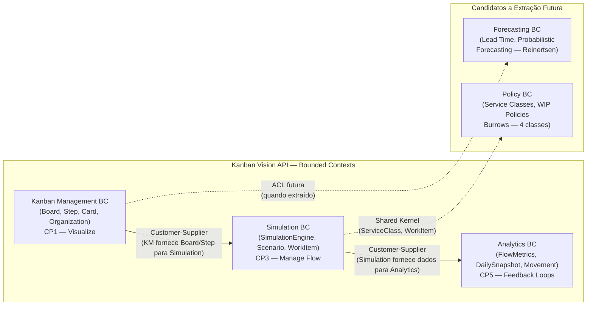

# ADR-0021 — OpenAPI Completeness + Context Map Mermaid

## Cabeçalho

| Campo     | Valor                        |
|-----------|------------------------------|
| Status    | Aceita                       |
| Data      | 2026-06-20                   |
| Execução  | —                            |
| Autores   | @agnaldo4j                   |
| Branch    | —                            |
| PR        | —                            |
| Supersede | —                            |

---

## Contexto e Motivação

Auditoria de qualidade de Jun/2026 identificou duas lacunas de documentação que mantêm as
dimensões **OpenAPI (8.5/10)** e **DDD (8.5/10)** abaixo da meta de 9.0:

1. **OpenAPI sem exemplos completos de request/response:** os endpoints mais críticos
   (`POST /simulations`, `POST /simulations/{id}/run`) não possuem exemplos de body JSON
   no Swagger UI. Desenvolvedores integrando a API precisam adivinhar o formato correto
   ou ler os testes. O `ktor-openapi` DSL já está presente e suporta blocos `example {}`.

2. **Context Map apenas textual:** `docs/context-map.md` foi criado no GAP-T com descrição
   em prosa dos 3 Bounded Contexts (Kanban Management, Simulation, Analytics) e seus
   relacionamentos. Falta um **diagrama Mermaid** renderizável diretamente no GitHub que
   torne as relações visualmente explícitas — especialmente Customer-Supplier e ACL.

Ambos são do tipo `[N]` Normativo: adicionam documentação sem alterar contratos ou código.

---

## Gaps Cobertos

| GAP | Título | Tipo |
|-----|--------|------|
| GAP-AK | OpenAPI: exemplos request/response completos | N |
| GAP-AM | Context Map: diagrama Mermaid formal | N |

---

## Decisões

### GAP-AK — OpenAPI Examples

**Decisão:** adicionar blocos `example {}` nos DTOs e rotas usando o `ktor-openapi` DSL já presente.

**Endpoints prioritários:**

```kotlin
// POST /simulations
post<SimulationsPath, CreateSimulationRequest, SimulationResponse>(
    info("Create Simulation", "Creates a new Kanban simulation scenario"),
) { _, body ->
    // ...
}

// DTO com exemplo:
@Serializable
data class CreateSimulationRequest(
    val organizationId: String,
    val wipLimit: Int,
    val teamSize: Int,
    val seedValue: Long,
) {
    companion object {
        val example = CreateSimulationRequest(
            organizationId = "org-550e8400-e29b-41d4-a716-446655440000",
            wipLimit = 3,
            teamSize = 5,
            seedValue = 42L,
        )
    }
}
```

**Formato do exemplo no DSL:**
```kotlin
// SimulationRoutes.kt — dentro do bloco de rota
example("default") {
    value = CreateSimulationRequest.example
}
```

**Endpoints a cobrir:**
- `POST /api/v1/simulations` — body `CreateSimulationRequest` + response `SimulationResponse`
- `POST /api/v1/simulations/{id}/run` — body `RunSimulationRequest` + response `RunSimulationResponse`
- `GET /api/v1/simulations` — response `Page<SimulationResponse>` com exemplo de paginação
- `GET /api/v1/simulations/{id}/cfd` — response array de `CfdDataPoint`

**Alternativa descartada:** exemplos em arquivo YAML separado — drift com o código; o DSL inline garante sincronismo.

### GAP-AM — Context Map com Diagrama Mermaid

**Decisão:** enriquecer `docs/context-map.md` com diagrama Mermaid no início do arquivo.

**Diagrama a adicionar:**



**Padrões de integração documentados:**
- **Customer-Supplier:** KM → SIM → ANA (fluxo atual no monólito — chamadas diretas)
- **ACL (Anti-Corruption Layer):** a usar quando Forecasting BC for extraído para serviço separado
- **Shared Kernel:** `ServiceClass` e `WorkItem` são conceitos partilhados entre Simulation e Policy BC

---

## Plano de Implementação

**1 sessão LLM — 1 PR:**

**GAP-AK (OpenAPI):**
1. Adicionar companion object `example` em `CreateSimulationRequest`, `RunSimulationRequest`
   (em `http_api/src/main/kotlin/com/kanbanvision/httpapi/routes/`)
2. Adicionar blocos `example("default") { value = ... }` nas rotas em `SimulationRoutes.kt`
   e `SimulationAnalyticsRoutes.kt`
3. Verificar no Swagger UI (`/swagger`) que exemplos aparecem no "Try it out"
4. Testes: garantir que rotas de teste passam (sem alteração de lógica)

**GAP-AM (Context Map):**
1. Editar `docs/context-map.md` — adicionar diagrama Mermaid após o título
2. Verificar que o diagrama renderiza corretamente no GitHub (preview local via `mermaid-cli` ou
   abertura direta no GitHub)

**Arquivos modificados:**
- `http_api/.../routes/SimulationRoutes.kt` (exemplos)
- `http_api/.../routes/SimulationAnalyticsRoutes.kt` (exemplos)
- `http_api/.../dtos/SimulationDtos.kt` (companion objects com exemplos)
- `docs/context-map.md` (diagrama Mermaid)

---

## Consequências

**Positivas:**
- OpenAPI sobe de 8.5 → 9.0 — Swagger UI mostra exemplos reais no "Try it out"
- DDD sobe de 8.5 → 9.0 — Context Map visualmente explícito para onboarding de novos devs
- Integração da API via Swagger UI não requer leitura de código ou testes
- Diagrama Mermaid é renderizado nativamente no GitHub sem ferramentas externas

**Negativas:**
- Exemplos no código (companion objects) são dados de exemplo que precisam ser mantidos atualizados
  se os DTOs mudarem — risco baixo (tipos são verificados pelo compilador via `value = DTO.example`)

**Neutras:**
- Nenhuma alteração em lógica de negócio, contratos HTTP ou schema de banco

---

## Referências

- ktor-openapi DSL: https://github.com/LukasForst/ktor-openapi-tools
- Mermaid: https://mermaid.js.org/
- Evans, Eric. *Domain-Driven Design*. Addison-Wesley, 2003 — capítulo Context Maps
- Burrows, Mike. *Kanban From the Inside*. Blue Hole Press, 2014
- Skill: [openapi-quality](.claude/skills/openapi-quality/SKILL.md)
- Skill: [ddd](.claude/skills/ddd/SKILL.md)
