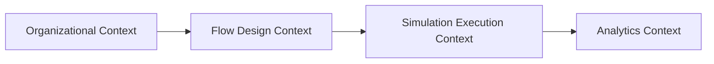
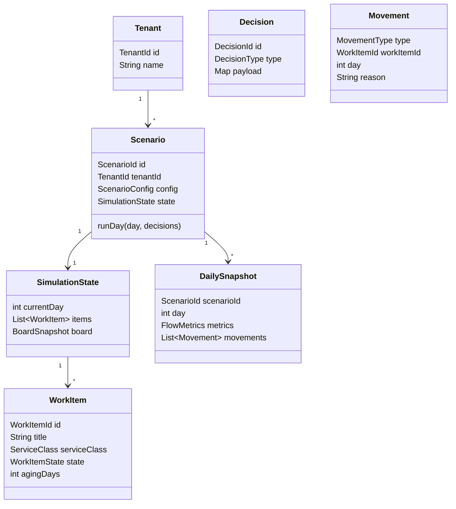
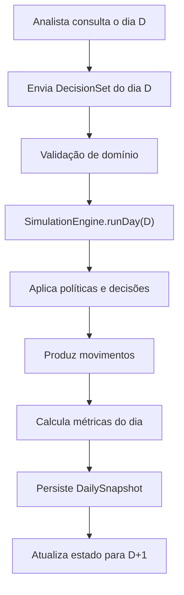
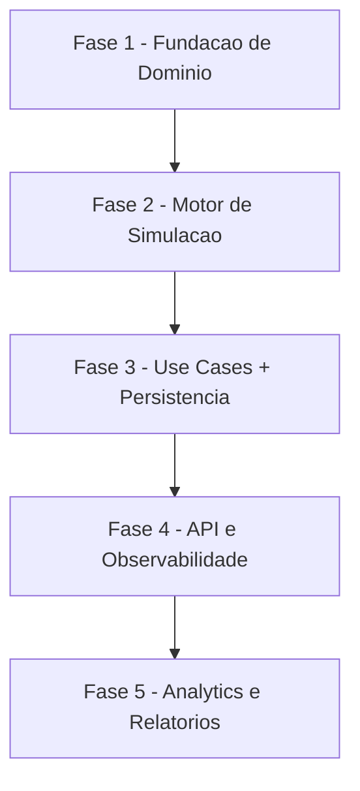

# Plano de Desenvolvimento do Zero - Simulador Kanban Multi-Organização (Kotlin)

## 1. Objetivo do plano

Este documento define, do zero, como construir um simulador Kanban para múltiplas organizações em Kotlin.

Escopo funcional esperado:

- Evolução diária da simulação (`dia D -> dia D+1`).
- Análise dos movimentos do dia.
- Envio de decisões pelo usuário.
- Execução da lógica de simulação com avaliação de impacto.
- Histórico comparável (timeline diária + métricas).

Este plano não assume herança de implementação prévia. Ele usa princípios de DDD, CQS e arquitetura hexagonal como base de construção.

## 2. Linguagem de domínio (ubíqua)

Termos que devem aparecer no código, API e documentação:

- `Tenant` - organização dona dos cenários.
- `Scenario` - simulação de fluxo para um tenant.
- `SimulationDay` - unidade de tempo discreta.
- `WorkItem` - item de trabalho que percorre o fluxo.
- `Policy` - regra operacional (WIP, pull, prioridade, SLA).
- `Decision` - ação escolhida pelo usuário para o dia.
- `Movement` - mudança ocorrida no dia (ex.: moveu, bloqueou, concluiu).
- `DailySnapshot` - estado consolidado no fim do dia.
- `FlowMetrics` - throughput, WIP, lead/cycle time, aging, blocked ratio.

## 3. Visão DDD por bounded contexts



### 3.1 Organizational Context

Responsável por:

- `Tenant`, times, pessoas, habilidades.

### 3.2 Flow Design Context

Responsável por:

- Board, colunas/etapas, políticas de fluxo, classes de serviço.

### 3.3 Simulation Execution Context

Responsável por:

- Planejamento e execução diária.
- Aplicação de decisões e políticas.
- Geração de movimentos e eventos.

### 3.4 Analytics Context

Responsável por:

- Comparação entre dias.
- Métricas e explicabilidade das decisões.
- Relatórios e projeções de leitura.

## 4. Modelo de domínio alvo



## 5. Regras de negócio essenciais do simulador

- Regra de capacidade por pessoa/time/habilidade por dia.
- Regra de limite de WIP por coluna.
- Regra de pull: item só avança se etapa destino tiver capacidade.
- Regra de priorização: classe de serviço e urgência.
- Regra de bloqueio/desbloqueio.
- Regra de aging e SLA.
- Regra de conclusão e throughput diário.
- Regra de isolamento: nenhuma operação cruza tenants.

## 6. Ciclo diário de simulação



## 7. Objetos de domínio recomendados (novos)

### 7.1 Entities

- `Scenario`
- `WorkItem`
- `Decision`
- `DailySnapshot`

### 7.2 Value Objects

- `TenantId`, `ScenarioId`, `WorkItemId`, `DecisionId`
- `SimulationDay`
- `PolicySet`
- `FlowMetrics`
- `CapacityProfile`

### 7.3 Domain Events

- `DayPlanned`
- `DecisionAccepted`
- `DecisionRejected`
- `WorkItemMoved`
- `WorkItemBlocked`
- `WorkItemUnblocked`
- `DayExecuted`
- `SnapshotCreated`

## 8. Estrutura Kotlin proposta (alvo)

A estrutura abaixo parte do seu projeto atual, mas orientada ao simulador completo:

```text
src/main/kotlin/
  domain/
    model/
      tenant/
        Tenant.kt
      scenario/
        Scenario.kt
        SimulationState.kt
        DailySnapshot.kt
      board/
        Board.kt
        Column.kt
      workitem/
        WorkItem.kt
        ServiceClass.kt
        WorkItemState.kt
      decision/
        Decision.kt
        DecisionSet.kt
      policy/
        PolicySet.kt
      events/
        DomainEvent.kt
        ...
      valueobjects/
        TenantId.kt
        ScenarioId.kt
        WorkItemId.kt
        DecisionId.kt
        SimulationDay.kt
        FlowMetrics.kt

  usecases/
    cqs/
      Command.kt
      Query.kt
    scenario/
      commands/
        CreateScenarioCommand.kt
        PlanDayCommand.kt
        RunDayCommand.kt
      queries/
        GetScenarioQuery.kt
        GetDailySnapshotQuery.kt
        ListMovementsByDayQuery.kt
      CreateScenarioUseCase.kt
      PlanDayUseCase.kt
      RunDayUseCase.kt
      GetDailySnapshotUseCase.kt

    repositories/
      ScenarioRepository.kt
      SnapshotRepository.kt
      EventStoreRepository.kt

  sql_persistence/
    repositories/
      JdbcScenarioRepository.kt
      JdbcSnapshotRepository.kt
      JdbcEventStoreRepository.kt

  http_api/
    routes/
      ScenarioRoutes.kt
      SimulationRoutes.kt
      AnalyticsRoutes.kt
```

## 9. Ajuste do que já existe no projeto Kotlin

Seu modelo atual (`Board`, `Card`, `Column`) é uma boa base visual, mas insuficiente para simulação diária.

Direcionamento:

- `Card` deve evoluir para `WorkItem` com estado temporal e métricas.
- `MoveCardUseCase` deve virar operação de decisão (`PlanDay`) e não apenas movimentação direta.
- `GetBoardUseCase` continua útil para leitura.
- Criar camada explícita de execução (`RunDayUseCase` + `SimulationEngine`).
- Adicionar `Scenario` como aggregate root principal.
- Criar persistência de snapshot diário e eventos.

## 10. Contratos de use case (CQS)

### 10.1 Commands

- `CreateScenarioCommand(tenantId, name, config)`
- `PlanDayCommand(tenantId, scenarioId, day, decisions)`
- `RunDayCommand(tenantId, scenarioId, day)`

### 10.2 Queries

- `GetScenarioQuery(tenantId, scenarioId)`
- `GetDailySnapshotQuery(tenantId, scenarioId, day)`
- `ListMovementsByDayQuery(tenantId, scenarioId, day)`
- `GetFlowMetricsRangeQuery(tenantId, scenarioId, fromDay, toDay)`

## 11. Estratégia de persistência (desde o início)

- Escrita:
  - estado do cenário (`scenario_state`),
  - eventos de domínio (`domain_events`),
  - snapshot diário (`daily_snapshots`).

- Leitura:
  - projeção de movimentos por dia,
  - projeção de métricas por período.

Chave de isolamento mínima em todas as tabelas:

- `tenant_id`, `scenario_id`, `day` (quando aplicável).

## 12. APIs mínimas do produto

- `POST /tenants/{tenantId}/scenarios`
- `GET /tenants/{tenantId}/scenarios/{scenarioId}`
- `POST /tenants/{tenantId}/scenarios/{scenarioId}/days/{day}/decisions`
- `POST /tenants/{tenantId}/scenarios/{scenarioId}/days/{day}/run`
- `GET /tenants/{tenantId}/scenarios/{scenarioId}/days/{day}/snapshot`
- `GET /tenants/{tenantId}/scenarios/{scenarioId}/days/{day}/movements`
- `GET /tenants/{tenantId}/scenarios/{scenarioId}/metrics?fromDay=X&toDay=Y`

## 13. Roadmap de desenvolvimento



### Fase 1 - Fundação de Domínio

- Modelar aggregates, entities e value objects.
- Definir invariantes formais.
- Criar testes de domínio (unitários e de regra).

Critério de aceite:

- Cenário pode ser criado com políticas válidas e isolamento por tenant.

### Fase 2 - Motor de Simulação

- Implementar `SimulationEngine.runDay`.
- Implementar cálculo de movimentos e métricas.
- Garantir determinismo com seed configurável.

Critério de aceite:

- Mesmo input (`state + decisions + seed`) gera mesmo output.

### Fase 3 - Use Cases + Persistência

- Implementar CQS completo para cenário, decisões e execução.
- Persistir estado, eventos e snapshots.

Critério de aceite:

- Rodar o dia persiste snapshot e permite recuperação exata.

### Fase 4 - API e Observabilidade

- Expor rotas HTTP do ciclo diário.
- Instrumentar logs, métricas e tracing por tenant/scenario/day.

Critério de aceite:

- Fluxo completo: analisar -> decidir -> rodar -> consultar resultado.

### Fase 5 - Analytics e Relatórios

- Construir consultas comparativas de dias e tendências.
- Expor explicabilidade das decisões e impactos.

Critério de aceite:

- Usuário consegue justificar por que o resultado do dia mudou.

## 14. Riscos e mitigação

- Complexidade de regra de negócio:
  - Mitigar com invariantes explícitas e testes de cenário.

- Não determinismo do motor:
  - Mitigar com seed e função pura no núcleo de execução.

- Acoplamento indevido com infraestrutura:
  - Mitigar com ports e domínio sem framework.

- Crescimento de consulta analítica:
  - Mitigar com snapshots e projeções específicas.

## 15. Definição de pronto (DoD)

Um incremento só é considerado pronto quando:

- Regra de domínio coberta por teste.
- Casos de uso expostos por contrato CQS.
- Persistência validada com isolamento multi-tenant.
- Observabilidade mínima habilitada (logs + métricas).
- Documento de decisão arquitetural atualizado.

## 16. Conclusão

Este plano posiciona o projeto Kotlin para construir, do zero, um simulador Kanban orientado a decisões e evolução diária, com DDD real no núcleo e capacidade analítica no produto final.

O foco principal é: modelar corretamente o domínio de execução antes de expandir API e persistência. Isso reduz retrabalho e aumenta previsibilidade da evolução.
