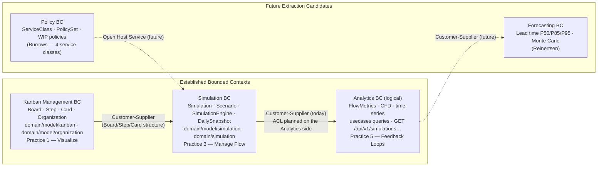

# Context Map

> References: *Kanban from the Inside* (Burrows) · *The Principles of Product Development Flow* (Reinertsen) · *Domain-Driven Design* (Evans)

A DDD Context Map for the project: the bounded contexts that exist today inside the modular monolith,
how they integrate, and the two contexts that are candidates for future extraction. It is a **living
design document** — use it to place new domain concepts and to reason about where a seam should form
if the monolith is ever split.

---

## Overview

> Solid arrows = relationships that exist today in the modular monolith; dashed arrows =
> planned/future relationships. The three established BCs share the **Shared Kernel** (`domain/` —
> entities, value objects, `DomainError`), detailed in [Integration Patterns](#integration-patterns).

---

## Established bounded contexts

### 1. Kanban Management

**Packages:** `domain/…/model/kanban/` + `domain/…/model/organization/`
**Aggregate roots:** `Board`, `Organization`

| Entity / VO | Type | Responsibility |
|---|---|---|
| `Board` | Aggregate root | Board structure; enforces unique step names |
| `Step` | Entity | Position in the flow; workers with a required ability |
| `Card` | Entity | Unit of work; state machine (TODO, IN_PROGRESS, BLOCKED, DONE) |
| `Organization` | Aggregate root | Team hierarchy (Tribe → Squad → Worker) |
| `Worker` | Entity | Deterministic (seeded) daily capacity per ability |
| `ServiceClass` | Enum | STANDARD · EXPEDITE · FIXED_DATE · INTANGIBLE |
| `AbilityName` | Enum | PRODUCT_MANAGER · DEVELOPER · TESTER · DEPLOYER |

**Domain invariants:** unique step name per board; `Step.assignWorker` requires the step's ability;
a `TESTER` worker also implies `DEPLOYER`.

**Ubiquitous language:** Board, Step, Card, Service Class, WIP, Aging, Effort, Ability, Seniority.

---

### 2. Simulation

**Packages:** `domain/…/model/simulation/` (entities, incl. `Scenario` + `ScenarioRules` — GAP-CE) +
`domain/…/simulation/SimulationEngine.kt` (domain service). `PolicySet` permanece em
`domain/…/model/organization/` (Kanban Management); `ScenarioRules` o referencia como aresta
`simulation → kanban` (customer-supplier, ADR-0038).
**Aggregate roots:** `Simulation`, `Scenario`

| Entity / VO | Type | Responsibility |
|---|---|---|
| `Simulation` | Aggregate root | Runtime state and lifecycle (DRAFT→RUNNING→PAUSED→FINISHED): `currentDay`, `decisions`, `history` |
| `Scenario` | Aggregate root | Immutable configuration: the `Board` + `ScenarioRules` |
| `ScenarioRules` | Value object | WIP limit, team size, deterministic seed (+ `PolicySet`) |
| `SimulationEngine` | Domain service | Pure, deterministic execution of one day |
| `Decision` | Sealed interface | A command applied to a day: `MoveItem` · `BlockItem` · `UnblockItem` · `AddItem` (ADR-0018 — sealed hierarchy, no type-tag + null-guards) |
| `DailySnapshot` | Entity | State captured at the end of each executed day |
| `FlowMetrics` | Value object | throughput, wipCount, blockedCount, avgAgingDays |
| `Movement` | Entity | Records each card movement within a day |

> **Configuration vs. runtime:** `Scenario` holds the *immutable* board + rules; the *mutable* run
> state (`currentDay`, `status`, applied `decisions`, `history` of snapshots) lives on `Simulation`.
> Keeping them apart is what lets `SimulationEngine.runDay(simulation, decisions, seed)` stay a pure
> function.

**Ubiquitous language:** Simulation Day, Scenario, Decision, Snapshot, WIP Limit, Seed, Throughput, Lead Time.

---

### 3. Analytics (logical)

A logical context, not yet a separate module — it reads Simulation output. Lives in the query use
cases and the read endpoints.

**Packages:** `usecases/…/simulation/` — `ListSimulations*`, `GetSimulationDays*`, `GetSimulationCfd*`

| Endpoint | Description |
|---|---|
| `GET /api/v1/simulations` | Paginated list of simulations |
| `GET /api/v1/simulations/{id}/days` | Time series of daily snapshots |
| `GET /api/v1/simulations/{id}/cfd` | Cumulative Flow Diagram data |

| DTO | Fields |
|---|---|
| `SimulationSummaryResponse` | id, name, status, currentDay |
| `SimulationDaysResponse` | simulationId, days: List\<DayMetricsResponse\> |
| `DayMetricsResponse` | day, throughput, wipCount, blockedCount, avgAgingDays |
| `CfdDataPointResponse` | day, throughputCumulative, wipCount, blockedCount |
| `SimulationCfdResponse` | simulationId, series: List\<CfdDataPointResponse\> |

**Ubiquitous language:** CFD, Time Series, Cumulative Throughput, Pagination, Day Series.

---

## Integration patterns

| Relationship | DDD pattern | State | Description |
|---|---|---|---|
| `domain/` → all modules | **Shared Kernel** | Current | Shared entities, VOs and `DomainError` — changes need cross-module coordination |
| `http_api` → `usecases` | **Customer-Supplier** | Current | `http_api` (customer) consumes CQS use cases (supplier); the supplier owns the contract |
| `sql_persistence` → `domain` | **Conformist** | Current | Persistence accepts the domain model without translation — tables mirror entities |
| `Simulation` → `Analytics` | **Customer-Supplier** | Current | Simulation (supplier) produces `DailySnapshot`/`FlowMetrics` that Analytics queries read directly in the monolith |
| `Analytics` → `Simulation` | **Anti-Corruption Layer** | Planned | Analytics should read `DailySnapshot` through an ACL to isolate its read model from the execution model |
| `Simulation` → `Policy Engine` | **Open Host Service** | Future | A Policy Engine exposes a stable protocol so Simulation can resolve decisions automatically |
| `Forecasting` → `Analytics` | **Customer-Supplier** | Future | Forecasting consumes aggregated Analytics data via a versioned contract |

> **Reading the map for extraction:** the *Planned* ACL and the *Future* Open Host Service are the
> seams where a module would split first — they are the relationships deliberately kept explicit so
> that, if extracted, each side owns its own model rather than sharing the kernel.

---

## Extraction candidates

### Forecasting

**Motivation** — *The Principles of Product Development Flow* (Reinertsen): quantitative flow analysis
yields lead-time and predictive insight beyond historical visualization.

**Future responsibility:** lead-time distribution (P50/P85/P95), throughput forecasting, Monte Carlo
simulation for probabilistic delivery estimates.

**Expected relationship:** Customer-Supplier downstream of Analytics (consumes `SimulationDaysResponse`
and `CfdDataPointResponse` without coupling to the execution model).

### Policy Engine

**Motivation** — *Kanban from the Inside* (Burrows): explicit policies are a core Kanban practice.
Today the policies (WIP limit, `ServiceClass` priority, escalation rules) are embedded in
`SimulationEngine`.

**Future responsibility:** escalation rules per `ServiceClass`, policy-driven decision automation
(MOVE/BLOCK), and configurable per-step limits/criteria.

**Expected relationship:** Open Host Service — exposes a stable protocol so `SimulationEngine` can
delegate automated decisions without coupling to the rules engine.

---

## Theoretical references

| Work | Author | Application here |
|---|---|---|
| *Kanban from the Inside* | Mike Burrows | Values, practices and the 4 service classes as a design lens for the BCs |
| *The Principles of Product Development Flow* | Donald Reinertsen | Flow metrics (throughput, WIP, lead time) and the basis of the Analytics BC |
| *Domain-Driven Design* | Eric Evans | Context Map patterns (Shared Kernel, ACL, Customer-Supplier, Open Host Service) |
| *Implementing DDD* | Vaughn Vernon | Bounded Context and integration-pattern guidance |

See also: [Wiki → Architecture Domain](https://github.com/agnaldo4j/kanban-vision-api-kt/wiki/Architecture-Domain) · [Wiki → Architecture](https://github.com/agnaldo4j/kanban-vision-api-kt/wiki/Architecture) · ADR-0021.
